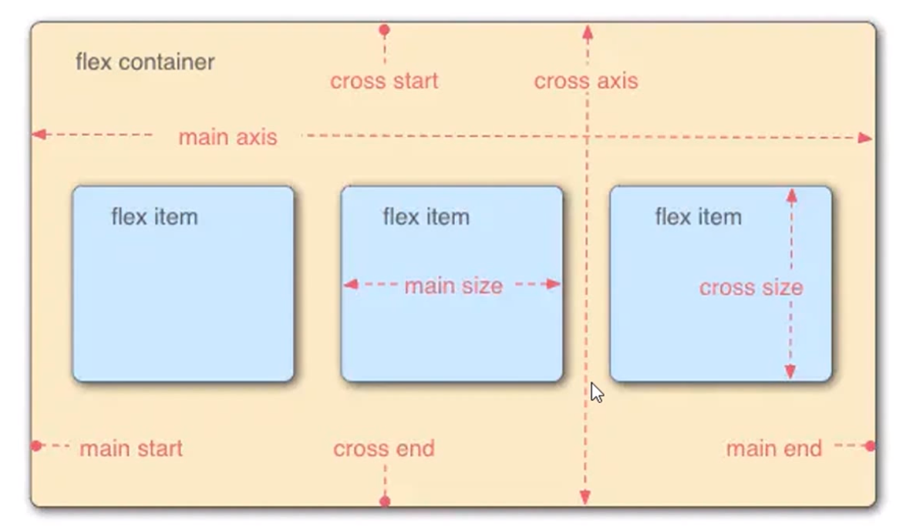

> - 课程：[六个案例学会响应式布局-慕课网](https://www.imooc.com/learn/1285)
> - 作者：[大谷](https://www.imooc.com/t/3414982)
> - 时长： 2小时41分 
> - 计划：3天 (实际4天)
> - 周期：2023/5/30 ~ 2023/06/04
> - 资源：..........


## 前言

响应式布局的需求（课程需求）：

- 解决页面布局在不同设备的显示情况
- 解决传统布局仅使用 float + position的局面，使用flex
- 使用em单位代替传统的px,%
- 掌握响应式布局，弹性布局等常用布局

课程安排

- CSS中媒体查询的作用和使用方法
- flex弹性盒子的用法
- rem的作用和使用方法
- 响应式布局、弹性布局等六个课程案例


## 媒体查询

概念：为不同尺寸的屏幕设定不同的CSS样式

媒体查询的示例代码

```html
<!DOCTYPE html>
<html lang="en">
<head>
    <meta charset="UTF-8">
    <meta http-equiv="X-UA-Compatible" content="IE=edge">
    <meta name="viewport" content="width=device-width, initial-scale=1.0">
    <title>媒体查询</title>
    <style>
        #div0{
            width: 100px;
            height: 200px;
        }
        /* 媒体查询 */
        /* 表示在屏幕尺寸 在 100px ~ 199px 之间生效 */
        @media screen and (min-device-width:100px) and (max-device-width:199px){
            #div0{
                background-color: green;
            }
        } 
        /* 表示在屏幕尺寸 在 200px ~ 300px 之间生效 */
        @media screen and (min-device-width:200px) and (max-device-width:300px){
            #div0{
                background-color: red;
            }
        } 
        /* 表示在屏幕尺寸 在 301px ~ 500px 之间生效 */
        @media screen and (min-device-width:301px) and (max-device-width:500px){
            #div0{
                background-color: blue;
            }
        } 
    </style>
</head>
<body>
    <div id="div0"></div>
</body>
</html>
```

### 常用参数

浏览器与设备

1. 浏览器：width, height
2. 设备：device-width, device-height


案例1：根据浏览器尺寸不同，决定元素显示颜色

```html
<!DOCTYPE html>
<html lang="en">
<head>
    <meta charset="UTF-8">
    <meta http-equiv="X-UA-Compatible" content="IE=edge">
    <meta name="viewport" content="width=device-width, initial-scale=1.0">
    <title>媒体查询</title>
    <style>
        #div0{
            width: 200px;
            height: 200px;
        }
        /* 表示在浏览器屏幕尺寸 在 500px ~ 700px 之间生效 */
        @media screen and (min-width:500px) and (max-width:700px){
            #div0{
                background-color: red;
            }
        } 
        /* 表示在浏览器屏幕尺寸 > 701px 生效 */
        @media screen and (min-width:701px){
            #div0{
                background-color: blue;
            }
        } 
       
    </style>
</head>
<body>
    <div id="div0"></div>
</body>
</html>
```

案例2：根据浏览器宽度（尺寸）决定元素排列方式

```html
<!DOCTYPE html>
<html lang="en">
<head>
    <meta charset="UTF-8">
    <meta http-equiv="X-UA-Compatible" content="IE=edge">
    <meta name="viewport" content="width=device-width, initial-scale=1.0">
    <title>媒体查询</title>
    <style>
        #div0 {
            width: 100%;
            height: 500px;
        }
        
        #div0 div {
            float: left;
            height: 100px;  
        }
        /* 1行三个div */
        @media screen and (min-device-width:400px){
            #div0 div {
                width: 33.3%;
            }
            #div0 div:nth-child(1) {
                background-color: red;
            }
            #div0 div:nth-child(2) {
                background-color: blue;
            }
            #div0 div:nth-child(3) {
                background-color: green;
            }
        }
        /* 2行三个div */
        @media screen and (min-device-width:300px) and (max-device-width:399px) {
            #div0 div {
                width: 50%;
            }
            #div0 div:nth-child(1) {
                background-color: red;
            }
            #div0 div:nth-child(2) {
                background-color: blue;
            }
            #div0 div:nth-child(3) {
                background-color: green;
            }
        }
        /* 3行三个div */
        @media screen and (min-device-width:200px) and (max-device-width:299px) {
            #div0 div {
                width: 100%;
            }
            #div0 div:nth-child(1) {
                background-color: red;
            }
            #div0 div:nth-child(2) {
                background-color: blue;
            }
            #div0 div:nth-child(3) {
                background-color: green;
            }
        }
    </style>
</head>
<body>
    <div id="div0">
        <div></div>
        <div></div>
        <div></div>
    </div>
</body>
</html>
```

### 引入方式1

对案例2的改进

```html
<!DOCTYPE html>
<html lang="en">
<head>
    <meta charset="UTF-8">
    <meta http-equiv="X-UA-Compatible" content="IE=edge">
    <meta name="viewport" content="width=device-width, initial-scale=1.0">
    <title>媒体查询</title>
    <!-- 提取公共样式 -->
    <style>
        #div0 {
            width: 100%;
            height: 500px;
        }
        #div0 div {
            float: left;
            height: 100px;
        }
    </style>
    <!-- 设置媒体查询样式 -->
    <!-- 3行三个div -->
    <style media="(min-device-width:200px) and (max-device-width:299px)">
        #div0 div {
            width: 100%;
        }
        #div0 div:nth-child(1) {
            background-color: red;
        }
        #div0 div:nth-child(2) {
            background-color: blue;
        }
        #div0 div:nth-child(3) {
            background-color: green;
        }
    </style>
    <!-- 2行三个div -->
    <style media="(min-device-width:300px) and (max-device-width:399px)">
        #div0 div {
            width: 50%;
        }
        #div0 div:nth-child(1) {
            background-color: red;
        }
        #div0 div:nth-child(2) {
            background-color: blue;
        }
        #div0 div:nth-child(3) {
            background-color: green;
        }
    </style>
    <!-- 1行三个div -->
    <style media="(min-device-width:400px)">
        #div0 div {
            width: 33.3%;
        }
        #div0 div:nth-child(1) {
            background-color: red;
        }
        #div0 div:nth-child(2) {
            background-color: blue;
        }
        #div0 div:nth-child(3) {
            background-color: green;
        }
    </style>
</head>
<body>
    <div id="div0">
        <div></div>
        <div></div>
        <div></div>
    </div>
</body>
</html>
```

### 引入方式2

对案例2的改进-采用外部css样式

**1，HTML部分**

```html
<!DOCTYPE html>
<html lang="en">
<head>
    <meta charset="UTF-8">
    <meta http-equiv="X-UA-Compatible" content="IE=edge">
    <meta name="viewport" content="width=device-width, initial-scale=1.0">
    <title>媒体查询</title>
    <!-- 引入公共样式 common.css -->
    <link rel="stylesheet" href="./css/common.css" >
    <!-- 引入媒体查询 样式 css1.css -->
    <link rel="stylesheet" href="./css/css1.css" media="(min-device-width:200px) and (max-device-width:299px)">
    <!-- 引入媒体查询 样式 css2.css -->
    <link rel="stylesheet" href="./css/css2.css" media="(min-device-width:300px) and (max-device-width:399px)">
    <!-- 引入媒体查询 样式 css3.css -->
    <link rel="stylesheet" href="./css/css3.css" media="(min-device-width:400px)">
</head>
<body>
    <div id="div0">
        <div></div>
        <div></div>
        <div></div>
    </div>
</body>
</html>
```

**2，CSS部分**

文件结构说明

```bash
.
├── css/
│   ├── common.css
│   ├── css1.css
│   ├── css2.css
│   └── css3.css
└── 04_media_query.html
```

```css
/* common.css */
/* 公共样式css */
#div0 {
    width: 100%;
    height: 500px;
}
#div0 div {
    float: left;
    height: 100px;
}
/* 子元素背景 */
#div0 div:nth-child(1) {
    background-color: red;
}
#div0 div:nth-child(2) {
    background-color: blue;
}
#div0 div:nth-child(3) {
    background-color: green;
}
```

```css
/* css1.css */
/* 3行三个div */
#div0 div {
    width: 100%;
}
```


```css
/* css2.css */
/* 2行三个div */
#div0 div {
    width: 50%;
}
```


```css
/* css3.css */
/* 1行三个div */
#div0 div {
    width: 33.3%;
}
```

## flex弹性布局

FlexiableBox即是**弹性盒子**，用来进行弹性布局，可以配合rem处理尺寸的适配问题。

用来为盒状模型提供最大的灵活性。任何一个容器都可以指定为Flex布局。更加符合响应式设计的特点

**1，主轴和交叉轴**

平面分为水平和垂直两个方向，分别可称为`x`,`y`轴。元素的排列方式有两种，**水平排列**或**垂直排列**。

元素的排列方式决定布局的 **主轴 （main axis）**，与主轴相对的方向被称为 **交叉轴 （cross axis）**

flex布局结构示意图：




### 主轴方向与换行

**1，主轴方向**

`flex-direction` 属性: 决定**元素在父元素盒子中的排列方式**

- row ：默认值, 元素 **从左到右**顺序显示
- row-reverse： 与 row 相反 元素从右到左顺序显示
- column ：元素 **从上到下**顺序显示
- column-reverse： 与 column 相反， 元素从下到上顺序显示

HTML

```html
<div id="div0">
        <div>1</div>
        <div>2</div>
        <div>3</div>
        <div>4</div>
</div>
```

CSS

```css
/* 设置父元素样式 */
#div0{
    width: 500px;
    background-color: violet;
    /* 给父元素 设置 display: flex 则子元素的布局会按照 flex布局排列 */
    display: flex;
    flex-direction: row-reverse;
}
/* 设置子元素样式 */
#div0 div{
    width: 100px;
    height: 100px;
    background-color: skyblue;
    border: 2px solid gold;
}
```

flex-direction布局示意图：


注意事项：

- 设置flex布局后的子元素的水平宽度是根据**父元素宽度以及元素个数计算出来的数值**。
- 如果**计算的宽度小于元素自身设置的宽度**，则以计算的宽度为为准压缩元素，否则已元素自身宽度为最终宽度。


**2，换行**

flex-wrap 属性：决定子元素在父元素盒子中的是否换行（列）
- nowrap ： 默认值。不换行或不换列。
- wrap： 换行或换列。
- wrap-reverse：换行或换列，但以相反的顺序。

flex-direction 与 flex-wrap 合并的简写方式

flex-flow 属性

```css
/* 格式： */
flex-flow: <flex-direction>  <flex-wrap>
/* 例子： */
flex-flow: row wrap;
```


### 剩余空间间隔处理

justify-content属性：用于子元素 与 父元素之间存在剩余空间时，设置间距的方式
- flex-start： 默认值，从左到右，紧挨着行头
- flex-end： 从右到左，紧挨着行尾
- center： 居中显示（水平）
- space-between： 平均分布在当前行，两边 不留有空间
- space-around： 平均分布在当前行，两边 留有空间

HTML

```html
<div id="div0">
    <div>1</div>
    <div>2</div>
    <div>3</div>
    <div>4</div>
</div>

<button class="bnt-start">flex-start</button>
<button class="bnt-end">flex-end</button>
<button class="bnt-center">center</button>
<button class="bnt-between">space-between</button>
<button class="bnt-around">space-around</button>

<script>
    const div0 = document.querySelector('#div0');
    const end = document.querySelector('.bnt-around')
    document.querySelector('.bnt-start').addEventListener('click', () => {
    div0.style.setProperty('justify-content', 'flex-start')
    })
    document.querySelector('.bnt-end').addEventListener('click', () => {
    div0.style.setProperty('justify-content', 'flex-end')
    })
    document.querySelector('.bnt-center').addEventListener('click', () => {
    div0.style.setProperty('justify-content', 'center')
    })
    document.querySelector('.bnt-between').addEventListener('click', () => {
    div0.style.setProperty('justify-content', 'space-between')
    })
    document.querySelector('.bnt-around').addEventListener('click', () => {
    div0.style.setProperty('justify-content', 'space-around')
    })
</script>
```

CSS

```css

#div0{
    /* 特殊情况 ，父元素的宽度对于 4个元素不足，对于3个子元素足够，此时会产生剩余空间  */
    width: 380px;
    background-color: violet;
    display: flex;
    flex-flow: row wrap;
    justify-content: space-between;
}
/* 设置子元素样式 */
#div0 div{
    width: 100px;
    height: 100px;
    background-color: skyblue;
}
```

效果演示：https://htmlpreview.github.io/?https://github.com/martinniee/responsive-layout-learning/blob/main/02_flex/01_flex2.html


### 交叉轴对齐方式

**1， align-items属性： 设置每个flex元素在交叉轴上的默认对齐方式**

- flex-start：位于交叉轴方向的上容器开头
- flex-end：位于交叉轴方向的上容器结尾
- center：位于交叉轴方向的上居中位置

**2， align-content 属性 （ align-items 类似）**


**3，align-items VS align-content**

- align-items    （对多个处理）
  -  在未设置 align-items 之前，将效果上换行后的每一行视为单独的个体，对多个个体处理，需要考虑个体间空间分配。

- align-content  （对一个处理）
  - 在未 设置 align-content 之前，将父元素下所有元素视为整体，然后进行处理


HTML

```html
<div id="div0">
    <div>1</div>
    <div>2</div>
    <div>3</div>
    <div>4</div>
</div>

<button class="bnt-items" title="在未设置 align-items 之前，将效果上换行后的每一行视为单独的个体，对多个个体处理，需要考虑个体间空间分配。">align-items</button>
<button class="bnt-content" title="在未 设置 align-content 之前，将父元素下所有元素视为整体，然后进行处理">align-content</button>

<script>
    const div0 = document.querySelector('#div0');
    const end = document.querySelector('.bnt-around')
    document.querySelector('.bnt-items').addEventListener('click', () => {
        div0.style.removeProperty('align-content')
        div0.style.setProperty('align-items', 'center')
    })
    document.querySelector('.bnt-content').addEventListener('click', () => {
        div0.style.removeProperty('align-items')
        div0.style.setProperty('align-content', 'center')
    })
</script>
```

CSS

```css
#div0 {
    width: 380px;
    height: 400px;
    background-color: violet;
    display: flex;
    flex-flow: row wrap;
    justify-content: space-between;
}

/* 设置子元素样式 */
#div0 div {
    width: 100px;
    height: 100px;
    background-color: skyblue;
}
```

效果演示：https://htmlpreview.github.io/?https://github.com/martinniee/responsive-layout-learning/blob/main/02_flex/01_flex3.html

### 子元素设置伸缩比例flex属性

三个属性

- flex-basis
- flex-grow
- flex-shrink


**一，flex-basis**  

**1，flex-basis属性值的几种类型**

- px 像素：设置子元素的初始值
- % 百分比：将百分比x父元素宽度得到的值作为初始值


**2，flex-basis设置方式**

	1. **统一在父元素选择器**中给所有在子元素设置（会均衡）
	1. **单独在不同的子元素的选择器**中设置


```css
/* 格式 */
flex-basis: px | % 
/* 例子 */
flex-basis: 50px | 30%
```


**二，flex-grow**

作用：设置弹性盒子的扩展比例

适用条件：`父元素宽度 - 所有子元素（设置了flex-basis）的宽度之和 > 0` , 也就是 **有剩余的空间的情况**。如果 `<0` ,就是**所有子元素宽度 > 父元素宽度**，而会导致子元素溢出（超出）父元素区域。

> ⚠️ 注意：元素默认设置有 `flex-shrink`属性，会自动进行平衡，若 是`<0`的情况，会自动重新计算子元素宽度，保证 最终的所有的 子元素宽度  = 父元素宽度。因此想要看到 “溢出”的效果，需要设置 `flex-shrink:0`来移除默认的样式。

1，flex-grow 算法

```markdown
单位量 = (父元素宽度 - 所有子元素宽度) / 总份数
子元素最终宽度 = 实际宽度 + ( 单位量 * 子元素所占份数)
```


**三，flex-shrink**

算法：和 flex-grow 类似，不过 元素默认有 flex-shrink 属性，自动进行了处理。

适用条件：`父元素宽度 - 所有子元素（设置了flex-basis）的宽度之和 <  0` , 就是**所有子元素宽度 > 父元素宽度**，而会导致子元素溢出（超出）父元素区域。

```markdown
单位量 = (所有子元素宽度 - 父元素宽度) / 总份数
子元素最终宽度 = 实际宽度 -  ( 单位量 * 子元素所占份数 )
```


**四，简写**

flex属性：用来将 flex-basis,flex-grow, flex-shrink属性简化在一起书写

```css
/* 格式 */
flex: <flex-grow> <flex-shrink> <flex-basis>
/* 例子 */
flex: 4 3 300px;
```


演示效果：https://htmlpreview.github.io/?https://github.com/martinniee/responsive-layout-learning/blob/main/02_flex/02_flex.html


### 给子元素设置伸缩的特殊写法（了解）

```markdown
----------1 auto 和 none----------
flex: auto 等价于 flex: 1 1 auto , 自动 扩大，缩小，宽度参照 子元素的初始值
flex: none 等价于 flex: 0 0 auto , 宽度参照 子元素的初始值
----------2. 设置单位----------
flex: 0% 等价于 flex: 1 1 0%
flex: 100px 等价于 flex: 1 1 100px
----------3. 设置数字----------
flex: 1 等价于 flex: 1 1 0%
flex: <number> ，默认设置的是 grow，即 flex: <number> 1 0%
flex: <number1> <number2>, 则分别设置 grow, shrink,即 flex: <number1> <number2> 0%
```

总结：
- 单位 对应`basis `   而 grow ,   shrink为 `1`
- 数值 对应 `grow`, `shrink`, 而 basis 为 `0%`


### 课堂案例1-输入框布局

HTML

```html
<!DOCTYPE html>
<html lang="en">
    <head>
        <meta charset="UTF-8">
        <meta http-equiv="X-UA-Compatible" content="IE=edge">
        <meta name="viewport" content="width=device-width, initial-scale=1.0">
        <title>课堂案例</title>
        <style>
            *{
                margin: 0;
                padding: 0;
            }
            #div0{
                width: 250px;
                display: flex;
                border: 1px solid #dcdcdc;
            }
            #div0 label{
                flex: 1;
                background-color: #f5f5f5;
                font-family: '黑体';
                text-align: center;
            }
            #div0 label:nth-child(3){
                flex:  1 1  25px;
            }
            #div0 input{
                border: none;
                outline: none;
            }
        </style>
    </head>
    <body>
        <div id="div0">
            <label >姓名</label>
            <input type="text" >
            <label >go</label>
        </div>
    </body>
</html>
```

效果图 ：


假设有一父元素，其下有两个label元素，中间一个input元素。

样式上：父元素宽为 `250px`,子元素input宽度为 `151.5px`，左右label都统一设置了 `flex: 1` , 右label单独设置了 `flex: 1 1 25px`, 左label没设置宽度（初始值）。

上述的 `25px` 是 `flex-basis`，如果元素没设置初始值，则此`flex-basis`作为初始值，也就是右 label宽度为 `25px`。


情况: 左label没设置初始宽度，若 `父元素宽度 - 其他宽度之和` 有剩余宽度，将 `剩余宽度 / 份数` 得到单位量 p。

相关数据的计算：

剩余宽度 = `父元素宽度 - 其他宽度之和` =  `250px - 151.5px - 25px` = `73.5px `

单位量p  = `剩余宽度 / 份数`  = `73.5px / 2` = `36.75px`

左label宽度 = `剩余宽度 - p * 左元素所占份数` =  `73.5px - (36.75px * 1)` = `36.75px`

右label宽度 = `右label宽度 + p * 右元素所占份数` =  `25px + (36.75px * 1)` =`61.75px`


总结：只会对设置了 `grow/shrink `的元素进行额外计算（扩充/缩减）。
- 如果元素设置了初始值（有 flex-basis值），则 `最终的宽度 = 元素宽度 +/- p * 所占份数`
- 如果元素**没有设置初始值**（没有 flex-basis值），则 `最终的宽度 = 剩余/超出宽度 +/- p * 所占份数`

### 课堂案例2-长表单布局

初始效果：


设置响应式布局后：


HTML

```html
<form>
    <div id="form">
        <div>
            <label>姓名：</label>
            <input type="text">
        </div>
        <div>
            <label>请输入密码：</label>
            <input type="text">
        </div>
        <div>
            <label>请再再再输入密码：</label>
            <input type="text">
        </div>
    </div>
</form>
```

CSS

```css
#form div{
    display: flex;
    /* 目的：设置两个输入组件上下间距 */
    /* 1. 使用 margin  */
    /* margin-top: 10px; */
    /* height: 30px; */
    /* 自适应（默认）  stretch*/
    align-items: flex-start;
    flex:  0 0 30px;
}
#form div label{
    flex: 0 0 140px;
    text-align: right;
}

#form{
    display: flex;
    flex-direction: column;
}
```

布局示意图：


⚠️ 注意事项：

```css
flex : 0 0 30px 
```

`30px` 表示是元素在 **主轴**方向上的长度。主轴是x，则表示宽度，否则表示高度。


### 课堂案例3-rem的使用方法

HTML

```html
<!DOCTYPE html>
<html lang="en">
    <head>
        <meta charset="UTF-8">
        <meta http-equiv="X-UA-Compatible" content="IE=edge">
        <meta name="viewport" content="width=device-width, initial-scale=1.0">
        <title>flex布局</title>
        <script>
            let c = () => {
                // 获取设备宽度
                let w = document.documentElement.clientWidth;
                // 计算根字体
                let n = (20 * (w / 320) > 40 ? 40 + "px" : (20 * (w / 320)) + "px");
                // 设置根字体
                document.documentElement.style.fontSize = n;
            }
            window.addEventListener('load', c);
            window.addEventListener('resize', c);
        </script>
        <style>
            /* 
            rem VS em 
            - rem：r 代表 root（根元素），相对 根元素字体大小
            - em：简单来说 相对 父元素字体大小（自身或继承）
            */
            html {
                /* html即 根元素，默认大小为 16px */
                font-size: 10px;
            }
            div {
                /* 1 rem = 一个 根元素 字体大小 */
                font-size: 1rem;
                /* 等价于 16px */
            }
        </style>
    </head>
    <body>
        <div>123</div>
    </body>
</html>
```

效果：https://htmlpreview.github.io/?https://github.com/martinniee/responsive-layout-learning/blob/main/02_flex/05_rem.html

使用移动端模式测试效果，增加/缩小屏幕宽度观察字体大小变化

### 课堂案例4-自适应布局


自适应布局

- 不同设备对应不同的html
- 局部自适应

总结：不同的设备用不同的页面或局部伸缩


HTML

```html
<div id="div0">
    <div>1</div>
    <div>2</div>
    <div>3</div>
</div>
```


CSS

```css
/* 
自适应布局
效果：左右div大小不变，中间div宽度随着屏幕宽度变化而相应变化
*/
#div0{
    display: flex;
}
#div0 div:first-child{
    background-color: yellow;
    flex: 0 0 50px;
}
#div0 div:nth-child(2){
    background-color: red;
    flex: 1 1  auto;

}
#div0 div:nth-child(3){
    background-color: yellow;
    flex: 0 0 50px;

}
/* 媒体查询 */
@media (min-device-width: 400px) and (max-device-width: 500px){
    #div0 div:nth-child(2){
        background-color: blue;
    }
}
@media (min-device-width: 501px) and (max-device-width: 600px){
    #div0 div:nth-child(2){
        background-color: green;
    }
}
```


自适应布局

效果：左右div大小不变，中间div宽度随着屏幕宽度变化而相应变化，同时设置媒体查询，中间div的颜色也跟随变化。


### 课堂案例5-响应式布局

响应式布局：确保一个页面在所有终端上，都能显示出令人满意的效果

设计思路： 使用%或rem作为单位，此处采用%为单位


效果见：https://htmlpreview.github.io/?https://github.com/martinniee/responsive-layout-learning/blob/main/04_layout1/layout1.html

> 主要是 css 部分内容多，需要结合布局分析


### 课堂案例6-rem弹性布局

rem弹性布局

- 布局特点：为了保证在各种屏幕上的不失真，就要根据实际屏幕宽度做等比例换算
- 一句话：一套方案，使不同尺寸、分辨率的视口，都能呈现出较好的效果。
- 设计思路： 使用`%`或`rem`作为单位，此处采用`rem`为单位


这个案例，个人并未完全按照教程案例代码实现，而且从个人思路出发，结合学习到的flex，响应式布局知识实现了一个类似效果的案例，内容，图片，结构都做了调整。然而在开发过程中遇到 了css 样式的问题，一时半会难以解决，发现是 css 基础中一些概念掌握不牢固。其中关于css有一个坑，容易被忽略，为了实现理想预期的效果，其实有很多其他解决方案，但个人还是试图寻求一个好的解决方案，并为了比较清晰的理解其原理，做了测试，实验，最终找到了额外的方法解决了问题。

有关于测试，探究的过程，后期有时间补充一个笔记： [坑]()。

此案例的预览效果（移动端模式预览）：https://htmlpreview.github.io/?https://github.com/martinniee/responsive-layout-learning/blob/main/05_layout2/index.html


---

**总结flex的使用：**

- 主轴对齐：使用 `justify-content `
- 交叉轴对齐： 使用 `align-items`  或 `align-content`
- 子元素伸缩：`flex-basis`,` flex-grow,` `flex-shrink`， 及三者简写` flex: <grow> <shrink> <basis>`


